  
  
  
  

Mechanical Engineering student at UCLA building at the intersection of physical systems and software. My work spans high-powered rockets, embedded control systems, autonomous drones, computer vision, and AI agents.

I care about taking ambitious ideas from CAD and simulation through fabrication, testing, and deployment.

## Experience

- **Design & Manufacturing Engineering Intern**, Mission College *(June 2026 - Present)*
  - Design and validate a high-powered rocket airframe and active tilt/roll control system using SolidWorks, Onshape, SimScale, an ESP32, and a Raspberry Pi 5.
  - Conducted 3,000+ hours of CFD simulations covering drag, pressure distribution, aerodynamic performance, and stability.
- **Associated Student Government Senator**, Mission College *(August 2025 - May 2026)*
  - Represented 6,000+ students and presented academic and operational recommendations to campus and district leadership.
- **Founder & President**, Mission Launch Rocketry
  - Led a 52-member rocketry club through the design, fabrication, and launch of high-power rockets with custom avionics and dual-deployment recovery.

## Achievements

**2x Hackathon Awards**

- **1st Place, Deepgram Track** - UC Berkeley AI Hackathon - [Aside AI](https://github.com/bryanph4m/AsideAI), a real-time AI wearable with selectable narration personalities.
- **1st Place, Beginner Track** - MLH x DigitalOcean Hackathon - **RollAway**, location intelligence and permit planning for San Francisco mobile food vendors.

<!-- Add future wins above this line using the same format. -->

## Skills

**Languages**

**CAD & Engineering**

**Software & Platforms**

## Stats

  
  

These cards refresh automatically every day through GitHub Actions.

  
  
  

